# AirSight AI — System Architecture Design

> **Document Status:** Draft v1.0
> **Author:** Principal Software Architect
> **Last Updated:** July 15, 2026
> **Hackathon:** ET AI Hackathon 2026
> **Scope:** Single-City MVP with Scalability Path

---

## Table of Contents

1. [High-Level Architecture](#1-high-level-architecture)
2. [Component Diagram](#2-component-diagram)
3. [Backend Architecture](#3-backend-architecture)
4. [Frontend Architecture](#4-frontend-architecture)
5. [AI/ML Pipeline](#5-aiml-pipeline)
6. [Data Pipeline](#6-data-pipeline)
7. [Database Design](#7-database-design)
8. [API Layer](#8-api-layer)
9. [Folder Structure](#9-folder-structure)
10. [Deployment Architecture](#10-deployment-architecture)
11. [Sequence Diagrams](#11-sequence-diagrams)
12. [Scalability Strategy](#12-scalability-strategy)
13. [Security Architecture](#13-security-architecture)

---

## 1. High-Level Architecture

AirSight AI follows a **layered, event-driven microservices architecture** with a clear separation between data ingestion, intelligence processing, and presentation tiers.

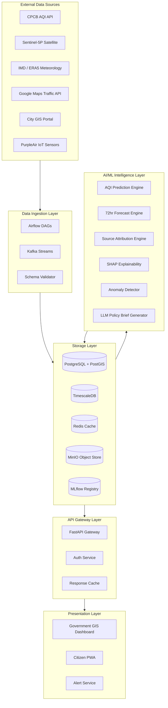

### Architectural Principles

| Principle | Decision | Rationale |
|---|---|---|
| **Separation of Concerns** | Strict layer boundaries | Independent scaling and testing |
| **Event-Driven Ingestion** | Kafka as message bus | Decouples producers from consumers, handles burst data |
| **API-First** | OpenAPI 3.0 spec before code | Enables parallel frontend/backend development |
| **Explainability-First** | SHAP baked into inference pipeline | Non-negotiable for government trust |
| **Cache-Aside** | Redis for hot AQI grids | Sub-100ms response for citizen app |
| **Schema-on-Write** | Strict validation at ingestion boundary | Prevents corrupt data propagating to ML models |

---

## 2. Component Diagram

```mermaid
graph LR
    subgraph CLIENT["Client Tier"]
        GD["Government Dashboard
(React + MapLibre GL)"]
        CA["Citizen PWA
(React + Vite)"]
        MA["Mobile App
(React Native)"]
    end

    subgraph GATEWAY["Gateway Tier"]
        AG["API Gateway
(FastAPI + Nginx)"]
        WS["WebSocket Server
(FastAPI WS)"]
        WH["Webhook Dispatcher"]
    end

    subgraph SERVICES["Service Tier"]
        AQS["AQI Service
(prediction + live data)"]
        FCS["Forecast Service
(72hr pipeline)"]
        ATR["Attribution Service
(source fingerprinting)"]
        ALS["Alert Service
(threshold engine)"]
        RPS["Report Service
(LLM + PDF gen)"]
        GIS["GIS Tile Service
(MapTiler + PostGIS)"]
        US["User Service
(auth + profiles)"]
    end

    subgraph ML["ML Inference Tier"]
        GNN["GNN AQI Model
(PyTorch Geometric)"]
        TSF["Transformer Forecast
(Temporal Fusion)"]
        SAT["Source Attribution
(XGBoost + SHAP)"]
        LLM["LLM Gateway
(Gemini Pro)"]
    end

    subgraph DATA["Data Tier"]
        PG[("PostgreSQL
+ PostGIS")]
        TS[("TimescaleDB
(Time Series)")]
        RD[("Redis
(Cache + PubSub)")]
        MN[("MinIO
(Satellite Files)")]
        MF[("MLflow
(Model Registry)")]
    end

    subgraph INGESTION["Ingestion Tier"]
        AF["Airflow
(Orchestrator)"]
        KF["Kafka
(Message Bus)"]
        SV["Schema Validator
(Pydantic + Great Expectations)"]
    end

    CLIENT --> GATEWAY
    GATEWAY --> SERVICES
    SERVICES --> ML
    SERVICES --> DATA
    ML --> DATA
    INGESTION --> DATA
```

---

## 3. Backend Architecture

### 3.1 Service Breakdown

The backend is composed of **7 domain services** behind a unified API gateway. Each service owns its domain logic and communicates via REST internally (MVP) or Kafka events (production).

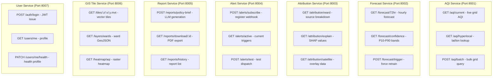

### 3.2 API Gateway Configuration

```
Nginx (Reverse Proxy + TLS termination)
  ├── /api/v1/aqi/*          → AQI Service
  ├── /api/v1/forecast/*     → Forecast Service
  ├── /api/v1/attribution/*  → Attribution Service
  ├── /api/v1/alerts/*       → Alert Service
  ├── /api/v1/reports/*      → Report Service
  ├── /api/v1/gis/*          → GIS Tile Service
  ├── /api/v1/auth/*         → User Service
  └── /ws/*                  → WebSocket Server
```

### 3.3 Technology Decisions — Backend

| Component | Technology | Justification |
|---|---|---|
| API Framework | FastAPI (Python 3.11+) | Async-native, Pydantic validation, auto OpenAPI docs |
| Task Queue | Celery + Redis | Forecast and report generation are async-long jobs |
| Orchestration | Apache Airflow 2.x | DAG-based pipeline scheduling with retry/backfill |
| Message Bus | Apache Kafka | Decoupled, replayable event stream for sensor data |
| ML Serving | FastAPI + ONNX Runtime | Low-latency inference; ONNX portable across frameworks |
| LLM Integration | Google Gemini Pro API | Structured prompt chains for policy brief generation |
| PDF Generation | WeasyPrint + Jinja2 | HTML-to-PDF for government reports |
| GIS Tiles | PostGIS + pg_tileserv | Native PostGIS vector tile serving |

---

## 4. Frontend Architecture

### 4.1 Application Overview

The frontend consists of two distinct applications sharing a common design system:

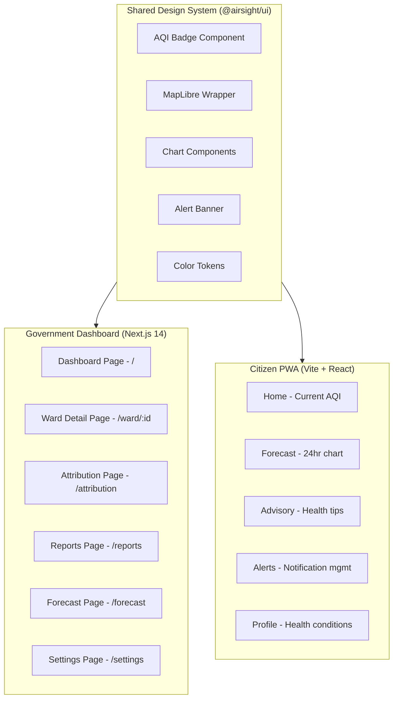

### 4.2 Government Dashboard Component Tree

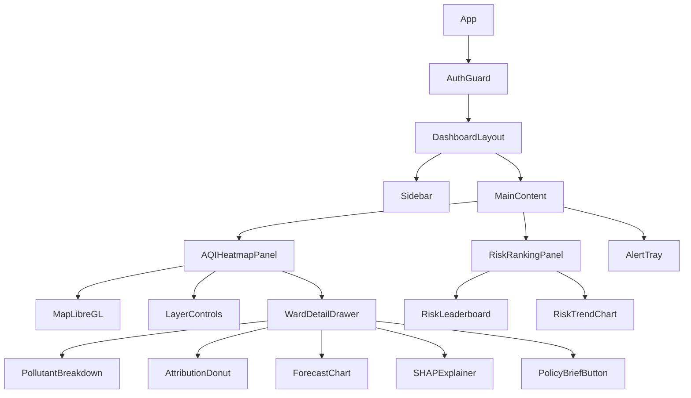

### 4.3 State Management Architecture

```
Zustand Stores (MVP — lightweight)
├── useMapStore          → viewport, active layers, selected ward
├── useAQIStore          → live AQI grid data, refresh timer
├── useForecastStore     → 72hr forecast data per ward
├── useAttributionStore  → source attribution results + SHAP
├── useAlertStore        → active alerts, thresholds
└── useAuthStore         → user, role, JWT token

React Query (Server State)
├── useCurrentAQI(wardId)
├── use72hrForecast(wardId)
├── useAttribution(wardId, dateRange)
├── useRiskRanking()
└── usePolicyBrief(wardId)
```

### 4.4 Real-Time Updates via WebSocket

```
WebSocket Connection: ws://api.airsight.in/ws/aqi-feed

Message Types:
  { type: "AQI_UPDATE",    payload: { grid_cells: [...], timestamp } }
  { type: "ALERT_TRIGGER", payload: { ward_id, level, message } }
  { type: "GRAP_STAGE",    payload: { stage, affected_wards, actions } }

Client handling:
  onmessage → dispatch to Zustand store → React re-renders affected components
```

### 4.5 Technology Decisions — Frontend

| Concern | Technology | Justification |
|---|---|---|
| Framework | Next.js 14 (Gov) / Vite+React (Citizen) | SSR for Gov SEO + fast SPA for citizen |
| GIS Map | MapLibre GL JS | Open-source, works with any tile server |
| Charts | Recharts + D3.js | Flexible, composable charting |
| State | Zustand + React Query | Lightweight client state + robust server sync |
| Styling | CSS Modules + CSS Variables | Scoped, no runtime overhead |
| UI Components | Radix UI (headless) + custom styles | Accessible primitives |
| Real-time | Native WebSocket + reconnect logic | Low overhead for AQI feed |
| Maps Tiles | Mapbox Streets (dev) / self-hosted MapTiler (prod) | Cost control in production |

---

## 5. AI/ML Pipeline

### 5.1 Pipeline Overview

```mermaid
graph LR
    subgraph RAW["Raw Data Store"]
        R1[AQI Readings]
        R2[Satellite AOD/NO2]
        R3[Meteorology]
        R4[Traffic]
        R5[Land Use]
    end

    subgraph FEATURE["Feature Engineering"]
        FE1[Spatial Interpolation
Kriging / IDW]
        FE2[Satellite Preprocessing
NDVI, AOD normalization]
        FE3[Temporal Features
hour-of-day, day-of-week, season]
        FE4[Lag Features
1hr, 6hr, 24hr, 7day lag AQI]
        FE5[Meteorological Features
wind vectors, BLH, stability class]
        FE6[Traffic Density
per-segment aggregation]
    end

    subgraph MODELS["Model Zoo"]
        M1["AQI Prediction
(Graph Attention Network)"]
        M2["72hr Forecast
(Temporal Fusion Transformer)"]
        M3["Source Attribution
(XGBoost + SHAP)"]
        M4["Anomaly Detection
(Isolation Forest)"]
    end

    subgraph XAI["Explainability"]
        X1[SHAP TreeExplainer]
        X2[SHAP Force Plots]
        X3[Feature Importance API]
    end

    subgraph OUTPUT["Inference Outputs"]
        O1[AQI Grid - 500m res]
        O2[72hr Forecast Bands]
        O3[Source Attribution %]
        O4[Anomaly Flags]
        O5[SHAP Explanations]
    end

    RAW --> FEATURE
    FEATURE --> MODELS
    MODELS --> XAI
    MODELS --> OUTPUT
    XAI --> OUTPUT
```

### 5.2 Model Specifications

#### Model 1 — Hyperlocal AQI Prediction (Graph Attention Network)

```
Architecture:   Graph Attention Network (GATv2)
Framework:      PyTorch Geometric
Input Graph:    Ward adjacency graph + spatial distance edges
Node Features:  [AQI_obs, PM25, PM10, NO2, temperature, humidity,
                 wind_speed, wind_dir, BLH, traffic_density,
                 land_use_type, hour_sin, hour_cos, day_sin, day_cos]
Edge Features:  [distance, wind_alignment, road_connection]
Output:         Per-node AQI scalar + pollutant breakdown
Resolution:     500m grid cells as graph nodes
Update Cycle:   Inference every 15 minutes
Training Data:  12 months CPCB + IMD historical data
Loss Function:  Huber Loss (robust to AQI spike outliers)
```

#### Model 2 — 72-Hour Probabilistic Forecast (Temporal Fusion Transformer)

```
Architecture:   Temporal Fusion Transformer (TFT)
Framework:      PyTorch + PyTorch Forecasting library
Input Horizon:  168 hours historical context (7 days)
Output Horizon: 72 hours ahead (hourly)
Output Type:    Quantile regression [P10, P50, P90]
Covariates:
  Known Future: hour, day-of-week, day-of-year, public_holiday flag
  Unknown:      AQI, traffic (treated as lagged)
  Static:       ward_id, land_use_category, industrial_density
Training:       Rolling window validation (last 30 days held out)
Inference:      Triggered every 6 hours; cached in Redis
```

#### Model 3 — Pollution Source Attribution (XGBoost + SHAP)

```
Architecture:   XGBoost multi-class classifier
Target:         Dominant source category
                [industrial, vehicular, construction, biomass, dust]
Features:       [NO2/SO2 ratio, CO/NO2 ratio, AOD magnitude,
                 temporal pattern (morning/evening peak vs continuous),
                 wind alignment to industrial zones,
                 satellite hotspot proximity, traffic speed,
                 temperature inversion flag]
Explainability: SHAP TreeExplainer — per-prediction feature attribution
Output:         Source probability distribution + SHAP force plot data
Validation:     Cross-validated against CPCB receptor model results
```

#### Model 4 — Anomaly Detection (Isolation Forest)

```
Algorithm:      Isolation Forest (sklearn)
Input:          Rolling 7-day AQI statistics per grid cell
Threshold:      Contamination = 0.05 (flag top 5% as anomalies)
Output:         anomaly_score in [-1, +1]; -1 = anomaly
Trigger:        Real-time inference on each new AQI reading
Alert:          If anomaly_score < -0.7, fire alert to Alert Service
```

### 5.3 SHAP Explainability Integration

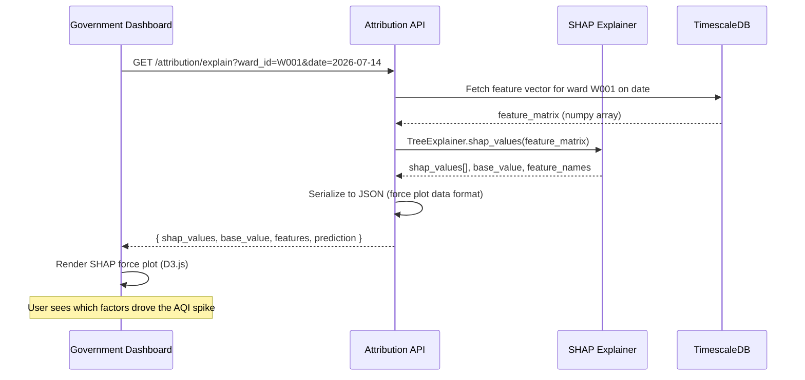

### 5.4 MLflow Model Registry

```
MLflow Tracking Server (sqlite backend for MVP)

Experiment: airsight-aqi-prediction
  Run 001: GAT v1 — MAE: 11.2, RMSE: 16.8
  Run 002: GAT v2 — MAE: 9.7,  RMSE: 14.3  [PRODUCTION]
  Run 003: GAT v3 — MAE: 9.1,  RMSE: 13.7  [STAGING]

Model Stages:
  None      → Experimental / Dev
  Staging   → Validated against holdout; under review
  Production → Serving live traffic
  Archived  → Deprecated

Promotion Flow:
  PR merged → CI runs eval script → if MAE < threshold → promote to Staging
  Manual approval by ML lead → promote to Production
```

### 5.5 Retraining Pipeline (Airflow DAG)

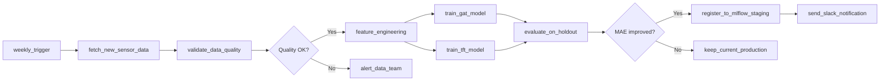

---

## 6. Data Pipeline

### 6.1 Ingestion Architecture

```mermaid
graph TB
    subgraph SOURCES["External Sources"]
        SRC1[CPCB API - REST polling]
        SRC2[Sentinel-5P - FTP/HTTP download]
        SRC3[IMD API - REST polling]
        SRC4[Google Maps - REST polling]
        SRC5[PurpleAir - REST polling]
        SRC6[City GIS - Shapefile download]
    end

    subgraph AIRFLOW["Airflow DAGs"]
        DAG1[cpcb_ingestion_dag
15min interval]
        DAG2[satellite_ingestion_dag
daily]
        DAG3[imd_ingestion_dag
hourly]
        DAG4[traffic_ingestion_dag
15min interval]
        DAG5[purpleair_ingestion_dag
5min interval]
        DAG6[gis_refresh_dag
weekly]
    end

    subgraph KAFKA["Kafka Topics"]
        K1[airsight.raw.aqi]
        K2[airsight.raw.satellite]
        K3[airsight.raw.meteorology]
        K4[airsight.raw.traffic]
        K5[airsight.processed.aqi-grid]
        K6[airsight.alerts.triggers]
    end

    subgraph CONSUMERS["Kafka Consumers"]
        C1[AQI Validator + Transformer]
        C2[Satellite Preprocessor]
        C3[Met Normalizer]
        C4[Traffic Aggregator]
        C5[ML Feature Store Writer]
        C6[Alert Threshold Engine]
    end

    subgraph STORAGE["Storage Sinks"]
        DB1[(TimescaleDB - time series)]
        DB2[(PostgreSQL/PostGIS - spatial)]
        DB3[(MinIO - raw satellite files)]
        DB4[(Redis - hot AQI cache)]
    end

    SOURCES --> AIRFLOW
    AIRFLOW --> KAFKA
    KAFKA --> CONSUMERS
    CONSUMERS --> STORAGE
```

### 6.2 Data Flow for AQI Reading

```
1. Airflow DAG polls CPCB API every 15 minutes
2. Raw JSON response published to: airsight.raw.aqi
3. AQI Validator consumer reads message:
   a. Pydantic schema validation (station_id, timestamp, PM25, PM10, etc.)
   b. Outlier check: if PM25 > 1000 or < 0 → quarantine + flag
   c. Unit normalization (all values to μg/m³)
   d. Station → spatial coordinate mapping
4. Validated record published to: airsight.processed.aqi-grid
5. TimescaleDB writer: INSERT INTO aqi_readings (station_id, ts, ...)
6. PostGIS spatial updater: UPDATE grid_cells SET current_aqi = ...
7. Redis hot cache writer: SET aqi:grid:{cell_id} "{aqi, pm25, ...}" EX 900
8. ML Feature Store: append to rolling feature matrix
9. Alert Engine: check if AQI > ward threshold → publish to airsight.alerts.triggers
```

### 6.3 Satellite Data Pipeline

```
1. Airflow checks Copernicus Open Access Hub for new Sentinel-5P products (daily)
2. Download .nc (NetCDF) file → upload to MinIO bucket: satellite-raw/
3. Preprocessing task (Python + rasterio):
   a. Clip to city bounding box
   b. Reproject to EPSG:4326
   c. Extract NO2, SO2, AOD layers
   d. Cloud mask application (remove pixels with QA < 0.75)
   e. Bilinear interpolation to 500m grid
4. Processed raster → write to MinIO: satellite-processed/
5. Per-grid-cell statistics extracted → INSERT into satellite_readings table
6. Trigger attribution model re-inference for affected date
```

### 6.4 Data Quality Framework

| Check | Tool | Action on Failure |
|---|---|---|
| Schema validation | Pydantic v2 | Reject + dead-letter queue |
| Null rate > 20% | Great Expectations | Alert data team; use cached prior |
| AQI value out of range [0–1000] | Custom rule | Quarantine; flag as suspect |
| Timestamp gap > 2 hours | Airflow SLA | Alert; back-fill from secondary source |
| Station offline > 6 hours | Health check DAG | Activate spatial interpolation fallback |
| Satellite cloud cover > 80% | QA band check | Skip day; use ERA5 reanalysis substitute |

---

## 7. Database Design

### 7.1 PostgreSQL + PostGIS Schema

```sql
-- =============================================================
-- SPATIAL REFERENCE DATA
-- =============================================================

CREATE TABLE city (
    city_id       UUID PRIMARY KEY DEFAULT gen_random_uuid(),
    name          TEXT NOT NULL,
    state         TEXT NOT NULL,
    bounding_box  GEOMETRY(POLYGON, 4326) NOT NULL,
    created_at    TIMESTAMPTZ DEFAULT NOW()
);

CREATE TABLE ward (
    ward_id       UUID PRIMARY KEY DEFAULT gen_random_uuid(),
    city_id       UUID REFERENCES city(city_id),
    ward_number   TEXT NOT NULL,
    ward_name     TEXT NOT NULL,
    geom          GEOMETRY(MULTIPOLYGON, 4326) NOT NULL,
    area_sqkm     DECIMAL(10,4),
    population    INTEGER,
    CONSTRAINT ward_city_unique UNIQUE (city_id, ward_number)
);
CREATE INDEX idx_ward_geom ON ward USING GIST(geom);

CREATE TABLE grid_cell (
    cell_id       UUID PRIMARY KEY DEFAULT gen_random_uuid(),
    ward_id       UUID REFERENCES ward(ward_id),
    centroid      GEOMETRY(POINT, 4326) NOT NULL,
    bounds        GEOMETRY(POLYGON, 4326) NOT NULL,
    resolution_m  INTEGER DEFAULT 500,
    land_use_type TEXT CHECK (land_use_type IN
                  ('residential','industrial','commercial',
                   'green','transport','mixed'))
);
CREATE INDEX idx_cell_geom ON grid_cell USING GIST(centroid);

-- =============================================================
-- AQI MONITORING STATIONS
-- =============================================================

CREATE TABLE monitoring_station (
    station_id    TEXT PRIMARY KEY,  -- CPCB station code
    name          TEXT NOT NULL,
    location      GEOMETRY(POINT, 4326) NOT NULL,
    ward_id       UUID REFERENCES ward(ward_id),
    source        TEXT CHECK (source IN ('CPCB','SPCB','PurpleAir','IoT')),
    active        BOOLEAN DEFAULT TRUE,
    installed_at  DATE
);
CREATE INDEX idx_station_geom ON monitoring_station USING GIST(location);

-- =============================================================
-- TIME SERIES DATA (TimescaleDB hypertables)
-- =============================================================

CREATE TABLE aqi_reading (
    ts            TIMESTAMPTZ NOT NULL,
    station_id    TEXT REFERENCES monitoring_station(station_id),
    aqi           SMALLINT,
    pm25          DECIMAL(8,2),
    pm10          DECIMAL(8,2),
    no2           DECIMAL(8,2),
    so2           DECIMAL(8,2),
    co            DECIMAL(8,2),
    o3            DECIMAL(8,2),
    data_quality  SMALLINT DEFAULT 100,  -- 0-100
    source        TEXT
);
SELECT create_hypertable('aqi_reading', 'ts');
CREATE INDEX ON aqi_reading (station_id, ts DESC);

CREATE TABLE aqi_grid_prediction (
    ts            TIMESTAMPTZ NOT NULL,
    cell_id       UUID REFERENCES grid_cell(cell_id),
    predicted_aqi DECIMAL(6,2),
    pm25_pred     DECIMAL(8,2),
    confidence    DECIMAL(4,3),       -- 0.0-1.0
    model_version TEXT
);
SELECT create_hypertable('aqi_grid_prediction', 'ts');
CREATE INDEX ON aqi_grid_prediction (cell_id, ts DESC);

CREATE TABLE aqi_forecast (
    generated_at  TIMESTAMPTZ NOT NULL,
    cell_id       UUID REFERENCES grid_cell(cell_id),
    forecast_ts   TIMESTAMPTZ NOT NULL,
    aqi_p10       DECIMAL(6,2),
    aqi_p50       DECIMAL(6,2),
    aqi_p90       DECIMAL(6,2),
    model_version TEXT
);
SELECT create_hypertable('aqi_forecast', 'generated_at');

CREATE TABLE satellite_reading (
    ts            TIMESTAMPTZ NOT NULL,
    cell_id       UUID REFERENCES grid_cell(cell_id),
    no2_column    DECIMAL(10,4),      -- mol/m2
    so2_column    DECIMAL(10,4),
    aod_550nm     DECIMAL(6,4),
    cloud_mask    BOOLEAN,
    qa_value      DECIMAL(4,3)
);
SELECT create_hypertable('satellite_reading', 'ts');

CREATE TABLE meteorology_reading (
    ts              TIMESTAMPTZ NOT NULL,
    ward_id         UUID REFERENCES ward(ward_id),
    temperature     DECIMAL(5,2),       -- Celsius
    humidity        DECIMAL(5,2),       -- %
    wind_speed      DECIMAL(6,2),       -- m/s
    wind_direction  SMALLINT,           -- degrees 0-360
    pressure        DECIMAL(8,2),       -- hPa
    boundary_layer_height DECIMAL(8,2), -- m
    precipitation   DECIMAL(6,2)        -- mm/hr
);
SELECT create_hypertable('meteorology_reading', 'ts');

-- =============================================================
-- SOURCE ATTRIBUTION
-- =============================================================

CREATE TABLE source_attribution (
    attribution_id UUID PRIMARY KEY DEFAULT gen_random_uuid(),
    ward_id        UUID REFERENCES ward(ward_id),
    ts             TIMESTAMPTZ NOT NULL,
    industrial_pct DECIMAL(5,2),
    vehicular_pct  DECIMAL(5,2),
    construction_pct DECIMAL(5,2),
    biomass_pct    DECIMAL(5,2),
    dust_pct       DECIMAL(5,2),
    dominant_source TEXT,
    confidence     DECIMAL(4,3),
    shap_values    JSONB,              -- serialized SHAP data
    model_version  TEXT
);
CREATE INDEX idx_attr_ward_ts ON source_attribution (ward_id, ts DESC);

-- =============================================================
-- ALERTS & REPORTS
-- =============================================================

CREATE TABLE alert_config (
    config_id     UUID PRIMARY KEY DEFAULT gen_random_uuid(),
    user_id       UUID REFERENCES app_user(user_id),
    ward_id       UUID REFERENCES ward(ward_id),
    aqi_threshold SMALLINT NOT NULL,
    channels      TEXT[] DEFAULT ARRAY['push'],  -- push, email, whatsapp, webhook
    webhook_url   TEXT,
    active        BOOLEAN DEFAULT TRUE
);

CREATE TABLE alert_event (
    event_id      UUID PRIMARY KEY DEFAULT gen_random_uuid(),
    ward_id       UUID REFERENCES ward(ward_id),
    triggered_at  TIMESTAMPTZ NOT NULL,
    aqi_value     DECIMAL(6,2),
    grap_stage    SMALLINT,
    resolved_at   TIMESTAMPTZ,
    dispatched_to TEXT[]
);

CREATE TABLE policy_report (
    report_id     UUID PRIMARY KEY DEFAULT gen_random_uuid(),
    ward_id       UUID REFERENCES ward(ward_id),
    generated_at  TIMESTAMPTZ DEFAULT NOW(),
    generated_by  UUID,
    date_range    TSTZRANGE,
    llm_prompt    TEXT,
    report_text   TEXT,
    pdf_path      TEXT,
    status        TEXT CHECK (status IN ('generating','ready','error'))
);

-- =============================================================
-- USER & AUTH
-- =============================================================

CREATE TABLE app_user (
    user_id       UUID PRIMARY KEY DEFAULT gen_random_uuid(),
    email         TEXT UNIQUE NOT NULL,
    name          TEXT,
    role          TEXT CHECK (role IN
                  ('citizen','ward_admin','district_admin',
                   'state_admin','researcher','api_user')),
    city_id       UUID REFERENCES city(city_id),
    ward_id       UUID REFERENCES ward(ward_id),
    health_profile JSONB,   -- encrypted; {conditions: [], age_group: ""}
    created_at    TIMESTAMPTZ DEFAULT NOW(),
    last_active   TIMESTAMPTZ
);

CREATE TABLE api_key (
    key_id        UUID PRIMARY KEY DEFAULT gen_random_uuid(),
    user_id       UUID REFERENCES app_user(user_id),
    key_hash      TEXT UNIQUE NOT NULL,
    name          TEXT,
    scopes        TEXT[],
    rate_limit    INTEGER DEFAULT 1000,  -- req/hour
    created_at    TIMESTAMPTZ DEFAULT NOW(),
    expires_at    TIMESTAMPTZ
);
```

### 7.2 Redis Data Model

```
Key Patterns:
  aqi:cell:{cell_id}            → Hash{aqi, pm25, pm10, ts}    TTL: 15min
  aqi:ward:{ward_id}            → Hash{avg_aqi, max_aqi, ts}   TTL: 15min
  forecast:72hr:{cell_id}       → JSON string                   TTL: 6hr
  attribution:{ward_id}:{date}  → JSON string                   TTL: 24hr
  alert:active:{ward_id}        → Set of alert_event_ids        TTL: none
  session:{user_id}             → JWT payload                    TTL: 24hr
  ratelimit:{api_key}:{hour}    → Counter                        TTL: 1hr
  risk:ranking:{city_id}:{date} → Sorted Set {ward_id: score}   TTL: 12hr

PubSub Channels:
  airsight:aqi-feed       → Broadcasts AQI updates to WebSocket clients
  airsight:alerts         → Broadcasts new alert events
  airsight:grap-trigger   → Broadcasts GRAP stage change events
```

### 7.3 MinIO Bucket Layout

```
Buckets:
  satellite-raw/
    YYYY/MM/DD/
      S5P_NRTI_NO2_{date}_{orbit}.nc
      S5P_NRTI_SO2_{date}_{orbit}.nc

  satellite-processed/
    YYYY/MM/DD/{city_id}/
      no2_grid.tif
      so2_grid.tif
      aod_grid.tif

  ml-models/
    gat-aqi/v{version}/
      model.onnx
      scaler.pkl
      graph_schema.json
    tft-forecast/v{version}/
      model.ckpt
      metadata.json

  policy-reports/
    {city_id}/{ward_id}/{report_id}.pdf
```

---

## 8. API Layer

### 8.1 Core Endpoints — OpenAPI Summary

```yaml
openapi: "3.0.3"
info:
  title: AirSight AI API
  version: "1.0.0"
  description: Urban Air Quality Intelligence Platform API

servers:
  - url: https://api.airsight.in/v1

paths:

  /aqi/current:
    get:
      summary: Get current AQI for a location
      parameters:
        - name: lat
          in: query
          required: true
          schema: { type: number }
        - name: lon
          in: query
          required: true
          schema: { type: number }
      responses:
        "200":
          description: AQI data for nearest grid cell
          content:
            application/json:
              schema:
                $ref: "#/components/schemas/AQIResponse"

  /forecast/72hr:
    get:
      summary: Get 72-hour probabilistic AQI forecast
      parameters:
        - name: ward_id
          in: query
          required: true
          schema: { type: string, format: uuid }
      responses:
        "200":
          description: Hourly forecast with confidence bands

  /attribution/ward:
    get:
      summary: Pollution source attribution for a ward
      parameters:
        - name: ward_id
          in: query
          required: true
          schema: { type: string, format: uuid }
        - name: date
          in: query
          schema: { type: string, format: date }
      responses:
        "200":
          description: Source breakdown with SHAP values

  /attribution/explain:
    get:
      summary: SHAP force plot data for attribution explanation
      parameters:
        - name: ward_id
          in: query
          required: true
          schema: { type: string, format: uuid }
        - name: date
          in: query
          schema: { type: string, format: date }
      responses:
        "200":
          description: SHAP values serialized for frontend rendering

  /gis/wards:
    get:
      summary: Ward boundaries GeoJSON for a city
      parameters:
        - name: city_id
          in: query
          required: true
          schema: { type: string, format: uuid }
      responses:
        "200":
          content:
            application/geo+json:
              schema: { type: object }

  /gis/heatmap:
    get:
      summary: AQI heatmap as GeoJSON feature collection
      parameters:
        - name: city_id
          in: query
          required: true
          schema: { type: string, format: uuid }
        - name: timestamp
          in: query
          schema: { type: string, format: date-time }
      responses:
        "200":
          content:
            application/geo+json:
              schema: { type: object }

  /risk/ranking:
    get:
      summary: Risk-ranked ward leaderboard for a city
      parameters:
        - name: city_id
          in: query
          required: true
          schema: { type: string, format: uuid }
        - name: date
          in: query
          schema: { type: string, format: date }
      responses:
        "200":
          description: Sorted array of wards with risk scores

  /reports/policy-brief:
    post:
      summary: Generate AI policy brief for a ward
      requestBody:
        required: true
        content:
          application/json:
            schema:
              type: object
              required: [ward_id, date_range]
              properties:
                ward_id: { type: string, format: uuid }
                date_range:
                  type: object
                  properties:
                    from: { type: string, format: date }
                    to:   { type: string, format: date }
      responses:
        "202":
          description: Report queued; returns report_id
          content:
            application/json:
              schema:
                type: object
                properties:
                  report_id: { type: string, format: uuid }
                  status:    { type: string, enum: [queued, generating] }

  /alerts/subscribe:
    post:
      summary: Subscribe to AQI threshold alerts
      requestBody:
        required: true
        content:
          application/json:
            schema:
              type: object
              required: [ward_id, aqi_threshold, channels]
              properties:
                ward_id:       { type: string, format: uuid }
                aqi_threshold: { type: integer, minimum: 0, maximum: 500 }
                channels:
                  type: array
                  items: { type: string, enum: [push, email, whatsapp, webhook] }
                webhook_url:   { type: string, format: uri }
      responses:
        "201":
          description: Subscription created
```

### 8.2 Response Schema Examples

```json
// GET /aqi/current
{
  "cell_id": "3f2504e0-4f89-11d3-9a0c-0305e82c3301",
  "ward_id": "5a3b04e0-4f89-11d3-9a0c-0305e82c3301",
  "ward_name": "Andheri West",
  "timestamp": "2026-07-15T00:15:00Z",
  "aqi": 178,
  "category": "Moderate",
  "color": "#FFA500",
  "pollutants": {
    "pm25":  { "value": 62.4, "unit": "μg/m³", "dominant": true  },
    "pm10":  { "value": 98.2, "unit": "μg/m³", "dominant": false },
    "no2":   { "value": 41.1, "unit": "μg/m³", "dominant": false },
    "so2":   { "value": 12.3, "unit": "μg/m³", "dominant": false },
    "co":    { "value": 1.2,  "unit": "mg/m³",  "dominant": false },
    "o3":    { "value": 88.0, "unit": "μg/m³", "dominant": false }
  },
  "confidence": 0.91,
  "model_version": "gat-v2.3.1",
  "data_sources": ["CPCB", "PurpleAir", "ERA5"]
}

// GET /attribution/ward
{
  "ward_id": "5a3b04e0-4f89-11d3-9a0c-0305e82c3301",
  "ward_name": "Andheri West",
  "date": "2026-07-14",
  "attribution": {
    "industrial":    { "percentage": 42.1, "confidence": 0.88 },
    "vehicular":     { "percentage": 31.4, "confidence": 0.92 },
    "construction":  { "percentage": 18.2, "confidence": 0.79 },
    "biomass":       { "percentage": 5.8,  "confidence": 0.71 },
    "dust":          { "percentage": 2.5,  "confidence": 0.65 }
  },
  "dominant_source": "industrial",
  "shap_preview": {
    "top_features": [
      { "name": "no2_so2_ratio",         "shap_value": 0.34 },
      { "name": "wind_alignment_ind",    "shap_value": 0.28 },
      { "name": "satellite_hotspot_dist","shap_value": 0.19 }
    ]
  },
  "model_version": "xgb-attr-v1.4.0"
}
```

### 8.3 WebSocket Message Protocol

```json
// Server → Client: AQI Update
{
  "type": "AQI_UPDATE",
  "ts": "2026-07-15T00:15:00Z",
  "payload": {
    "city_id": "...",
    "updates": [
      { "cell_id": "...", "ward_id": "...", "aqi": 178, "pm25": 62.4 },
      { "cell_id": "...", "ward_id": "...", "aqi": 212, "pm25": 89.1 }
    ]
  }
}

// Server → Client: Alert Trigger
{
  "type": "ALERT_TRIGGER",
  "ts": "2026-07-15T00:15:00Z",
  "payload": {
    "event_id":    "...",
    "ward_id":     "...",
    "ward_name":   "Dharavi",
    "aqi":         287,
    "grap_stage":  2,
    "grap_label":  "Poor",
    "recommended_actions": [
      "Restrict construction activities",
      "Increase road sweeping frequency",
      "Issue public health advisory"
    ]
  }
}
```

---

## 9. Folder Structure

```
airsight-ai/
├── README.md
├── docker-compose.yml              # Local dev orchestration
├── .env.example
│
├── docs/
│   ├── PRD.md
│   ├── SYSTEMDESIGN.md
│   └── api/
│       └── openapi.yaml
│
├── infrastructure/
│   ├── terraform/
│   │   ├── main.tf
│   │   ├── variables.tf
│   │   └── modules/
│   │       ├── gke/
│   │       ├── cloudsql/
│   │       └── redis/
│   ├── k8s/
│   │   ├── namespaces/
│   │   ├── services/
│   │   │   ├── aqi-service.yaml
│   │   │   ├── forecast-service.yaml
│   │   │   ├── attribution-service.yaml
│   │   │   └── ...
│   │   ├── ingress/
│   │   │   └── nginx-ingress.yaml
│   │   └── monitoring/
│   │       ├── prometheus.yaml
│   │       └── grafana.yaml
│   └── docker/
│       ├── Dockerfile.api
│       ├── Dockerfile.ml
│       └── Dockerfile.frontend
│
├── backend/
│   ├── gateway/                    # Nginx config
│   │   └── nginx.conf
│   │
│   ├── shared/                     # Shared Python utilities
│   │   ├── __init__.py
│   │   ├── config.py               # Pydantic settings
│   │   ├── database.py             # SQLAlchemy async engine
│   │   ├── redis_client.py
│   │   ├── kafka_client.py
│   │   ├── models/                 # SQLAlchemy ORM models
│   │   │   ├── aqi.py
│   │   │   ├── ward.py
│   │   │   ├── user.py
│   │   │   └── ...
│   │   └── schemas/                # Pydantic API schemas
│   │       ├── aqi.py
│   │       ├── forecast.py
│   │       └── ...
│   │
│   ├── services/
│   │   ├── aqi_service/
│   │   │   ├── main.py             # FastAPI app
│   │   │   ├── router.py
│   │   │   ├── service.py          # Business logic
│   │   │   ├── cache.py            # Redis caching layer
│   │   │   └── requirements.txt
│   │   │
│   │   ├── forecast_service/
│   │   │   ├── main.py
│   │   │   ├── router.py
│   │   │   ├── service.py
│   │   │   ├── tasks.py            # Celery tasks
│   │   │   └── requirements.txt
│   │   │
│   │   ├── attribution_service/
│   │   │   ├── main.py
│   │   │   ├── router.py
│   │   │   ├── service.py
│   │   │   ├── shap_explainer.py
│   │   │   └── requirements.txt
│   │   │
│   │   ├── alert_service/
│   │   │   ├── main.py
│   │   │   ├── router.py
│   │   │   ├── threshold_engine.py
│   │   │   ├── dispatchers/
│   │   │   │   ├── push.py
│   │   │   │   ├── whatsapp.py
│   │   │   │   └── webhook.py
│   │   │   └── requirements.txt
│   │   │
│   │   ├── report_service/
│   │   │   ├── main.py
│   │   │   ├── router.py
│   │   │   ├── llm_generator.py    # Gemini Pro integration
│   │   │   ├── pdf_renderer.py     # WeasyPrint
│   │   │   ├── templates/
│   │   │   │   └── policy_brief.html
│   │   │   └── requirements.txt
│   │   │
│   │   ├── gis_service/
│   │   │   ├── main.py
│   │   │   ├── router.py
│   │   │   ├── tile_generator.py
│   │   │   └── requirements.txt
│   │   │
│   │   └── user_service/
│   │       ├── main.py
│   │       ├── router.py
│   │       ├── auth.py             # JWT + OAuth2
│   │       └── requirements.txt
│   │
│   └── websocket_server/
│       ├── main.py
│       └── handlers.py
│
├── ml/
│   ├── data/                       # Local data samples (gitignored for large files)
│   │   └── sample/
│   │
│   ├── notebooks/                  # Exploratory analysis
│   │   ├── 01_eda_cpcb.ipynb
│   │   ├── 02_satellite_preprocessing.ipynb
│   │   └── 03_model_baseline.ipynb
│   │
│   ├── feature_engineering/
│   │   ├── __init__.py
│   │   ├── spatial.py              # Kriging, IDW interpolation
│   │   ├── temporal.py             # Lag features, cyclical encoding
│   │   ├── meteorology.py
│   │   └── satellite.py
│   │
│   ├── models/
│   │   ├── gat_aqi/
│   │   │   ├── model.py            # PyTorch Geometric GATv2
│   │   │   ├── train.py
│   │   │   ├── evaluate.py
│   │   │   └── export_onnx.py
│   │   │
│   │   ├── tft_forecast/
│   │   │   ├── model.py            # PyTorch Forecasting TFT
│   │   │   ├── train.py
│   │   │   └── evaluate.py
│   │   │
│   │   ├── attribution/
│   │   │   ├── model.py            # XGBoost classifier
│   │   │   ├── train.py
│   │   │   ├── shap_analysis.py
│   │   │   └── evaluate.py
│   │   │
│   │   └── anomaly/
│   │       ├── model.py            # Isolation Forest
│   │       └── train.py
│   │
│   ├── serving/
│   │   ├── inference_server.py     # ONNX Runtime + FastAPI
│   │   └── model_loader.py
│   │
│   └── pipelines/
│       ├── airflow/
│       │   ├── dags/
│       │   │   ├── cpcb_ingestion.py
│       │   │   ├── satellite_ingestion.py
│       │   │   ├── imd_ingestion.py
│       │   │   ├── traffic_ingestion.py
│       │   │   ├── feature_engineering.py
│       │   │   └── model_retraining.py
│       │   └── plugins/
│       │       └── airsight_operators.py
│       │
│       └── kafka/
│           ├── consumers/
│           │   ├── aqi_consumer.py
│           │   ├── satellite_consumer.py
│           │   └── alert_consumer.py
│           └── producers/
│               └── sensor_simulator.py  # For dev/testing
│
├── frontend/
│   ├── packages/
│   │   └── ui/                     # Shared design system
│   │       ├── src/
│   │       │   ├── components/
│   │       │   │   ├── AQIBadge/
│   │       │   │   ├── MapWrapper/
│   │       │   │   ├── ForecastChart/
│   │       │   │   ├── SHAPForceplot/
│   │       │   │   └── AlertBanner/
│   │       │   └── tokens/
│   │       │       ├── colors.css
│   │       │       └── typography.css
│   │       └── package.json
│   │
│   ├── apps/
│   │   ├── government-dashboard/   # Next.js 14
│   │   │   ├── app/
│   │   │   │   ├── layout.tsx
│   │   │   │   ├── page.tsx        # Root → GIS Dashboard
│   │   │   │   ├── ward/
│   │   │   │   │   └── [id]/
│   │   │   │   │       └── page.tsx
│   │   │   │   ├── attribution/
│   │   │   │   │   └── page.tsx
│   │   │   │   ├── forecast/
│   │   │   │   │   └── page.tsx
│   │   │   │   └── reports/
│   │   │   │       └── page.tsx
│   │   │   ├── components/
│   │   │   ├── stores/             # Zustand stores
│   │   │   ├── hooks/              # React Query hooks
│   │   │   └── package.json
│   │   │
│   │   └── citizen-app/            # Vite + React PWA
│   │       ├── src/
│   │       │   ├── App.tsx
│   │       │   ├── pages/
│   │       │   ├── components/
│   │       │   ├── stores/
│   │       │   └── service-worker.ts
│   │       └── package.json
│   │
│   └── package.json                # Turborepo workspace root
│
├── scripts/
│   ├── setup_db.py                 # Run migrations + seed data
│   ├── seed_sample_data.py         # Sample city + ward data
│   ├── simulate_sensors.py         # Dev sensor data simulator
│   └── test_api.sh                 # Curl-based smoke tests
│
└── tests/
    ├── unit/
    │   ├── test_feature_engineering.py
    │   ├── test_attribution_model.py
    │   └── test_alert_threshold.py
    ├── integration/
    │   ├── test_aqi_api.py
    │   ├── test_forecast_pipeline.py
    │   └── test_websocket.py
    └── fixtures/
        └── sample_data.json
```

---

## 10. Deployment Architecture

### 10.1 MVP Deployment (Hackathon — Docker Compose)

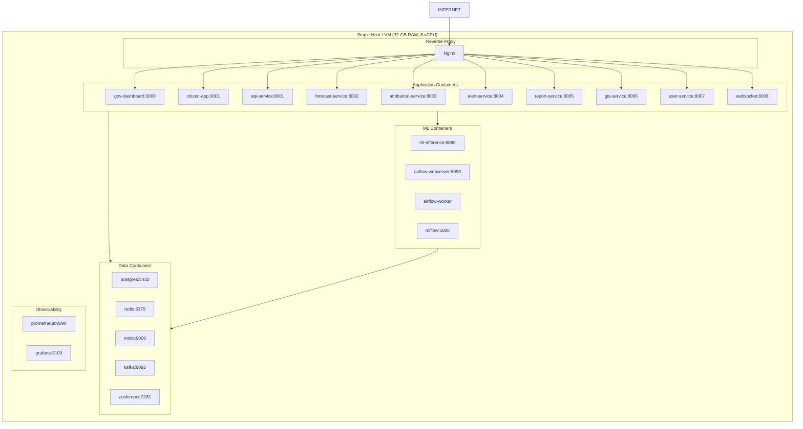

### 10.2 Production Deployment (Kubernetes / GKE)

```mermaid
graph TB
    subgraph INTERNET["Internet"]
        USR[Users]
        EXT[External APIs]
    end

    subgraph CDN["CDN Layer"]
        CF[Cloudflare CDN
+ WAF + DDoS]
    end

    subgraph GKE["GKE Cluster — us-south1"]
        subgraph INGRESS["Ingress"]
            NI[Nginx Ingress Controller]
            CERT[cert-manager
(Let's Encrypt)]
        end

        subgraph NS_API["Namespace: api"]
            AG[API Gateway Pods
(3 replicas, HPA)]
            WS2[WebSocket Pods
(2 replicas)]
        end

        subgraph NS_SVC["Namespace: services"]
            SVC[Service Pods
(1-3 replicas each, HPA)]
        end

        subgraph NS_ML["Namespace: ml"]
            INF[Inference Pods
(2 replicas, GPU node)]
            AF2[Airflow
(StatefulSet)]
        end

        subgraph NS_DATA["Namespace: data"]
            PGO[CloudSQL Proxy
(sidecar)]
            RDC[Redis Cluster
(Memorystore)]
        end
    end

    subgraph MANAGED["Google Managed Services"]
        SQL[Cloud SQL
PostgreSQL 15 + PostGIS]
        MEM[Cloud Memorystore
Redis]
        GCS[Cloud Storage
(MinIO replacement)]
        AR[Artifact Registry
(Docker images)]
    end

    subgraph OBS2["Observability Stack"]
        PM[Cloud Monitoring
+ Prometheus]
        GRF[Grafana]
        LG[Cloud Logging]
        TR[Cloud Trace]
    end

    USR --> CF
    CF --> NI
    NI --> NS_API
    NS_API --> NS_SVC
    NS_SVC --> NS_ML
    NS_SVC --> NS_DATA
    NS_DATA --> MANAGED
    NS_ML --> MANAGED
    OBS2 -.monitors.- GKE
```

### 10.3 Environment Configuration

| Environment | Infrastructure | Purpose |
|---|---|---|
| **Local Dev** | Docker Compose | Individual developer, seeded sample data |
| **Hackathon Demo** | Single VM (GCP e2-standard-8) | Live demo, 1-city data |
| **Staging** | GKE — 3-node cluster | Integration tests, pre-prod validation |
| **Production** | GKE — auto-scaling, regional | Live government and citizen traffic |

---

## 11. Sequence Diagrams

### 11.1 Citizen App — Fetch Hyperlocal AQI

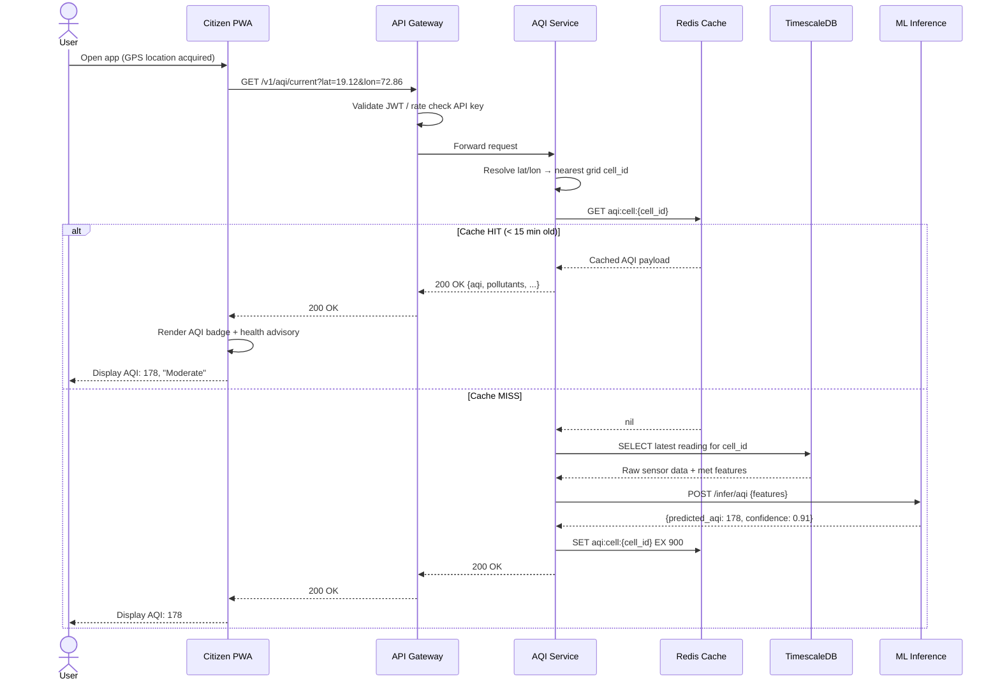

### 11.2 Government Dashboard — Generate Policy Brief

```mermaid
sequenceDiagram
    actor DC as District Collector
    participant DASH as Gov Dashboard
    participant GW as API Gateway
    participant RS as Report Service
    participant ATS as Attribution Service
    participant LLM as Gemini Pro API
    participant PDF as PDF Renderer
    participant MN as MinIO
    participant CL as Celery Worker

    DC->>DASH: Click "Generate Policy Brief" for Ward W001
    DASH->>GW: POST /v1/reports/policy-brief {ward_id, date_range}
    GW->>RS: Forward (auth: district_admin role verified)
    RS->>CL: Enqueue report generation task
    RS-->>DASH: 202 Accepted {report_id, status: "queued"}
    DASH-->>DC: "Report generating... (~30 sec)"

    Note over CL: Async Celery Worker picks up task

    CL->>ATS: GET /attribution/ward?ward_id=W001
    ATS-->>CL: Source attribution + SHAP data
    CL->>ATS: GET /attribution/explain?ward_id=W001
    ATS-->>CL: Feature importance narrative
    CL->>LLM: POST structured prompt with attribution data
    Note over LLM: Gemini Pro generates:
- Executive summary
- Top 3 sources
- Recommended GRAP actions
- Expected AQI improvement
    LLM-->>CL: Generated report text (JSON structured)
    CL->>PDF: Render HTML template → PDF
    PDF-->>CL: report.pdf bytes
    CL->>MN: Upload to policy-reports/{ward}/{report_id}.pdf
    CL->>RS: UPDATE policy_report SET status='ready', pdf_path=...

    DASH->>GW: GET /v1/reports/{report_id}/status (polling or WS)
    GW->>RS: Check status
    RS-->>DASH: {status: "ready", download_url: "..."}
    DASH-->>DC: "Report ready — Download PDF"
    DC->>DASH: Click download
    DASH->>MN: Signed URL redirect
    MN-->>DC: policy_brief_W001_2026-07-14.pdf
```

### 11.3 Data Ingestion — CPCB AQI Reading

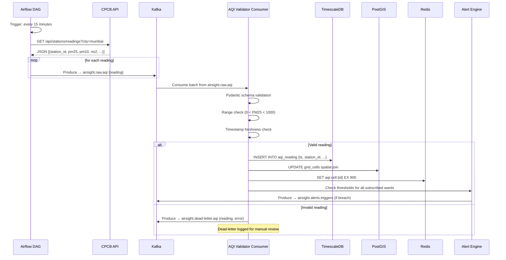

### 11.4 Alert Notification Flow

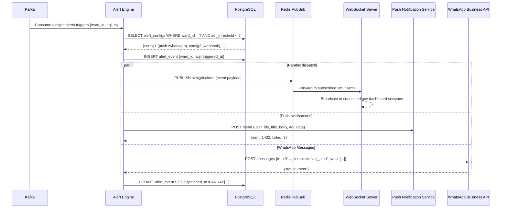

---

## 12. Scalability Strategy

### 12.1 Horizontal Scaling Plan

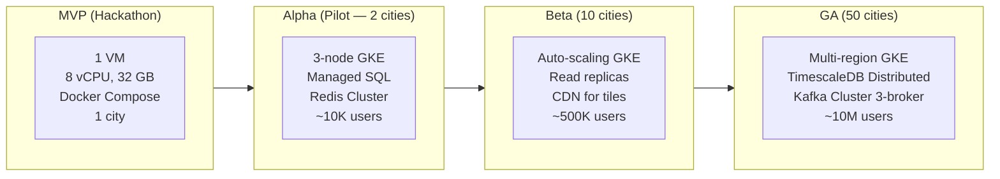

### 12.2 Per-Component Scaling Strategy

| Component | MVP | Alpha | Beta | GA |
|---|---|---|---|---|
| **API Services** | Single process | 2-3 replicas + HPA | 3-10 replicas + HPA | Multi-region, HPA |
| **PostgreSQL** | Single instance | Cloud SQL + 1 read replica | 3 read replicas | TimescaleDB distributed + Citus |
| **Redis** | Single node | Cloud Memorystore Basic | Cloud Memorystore HA | Redis Cluster (6 nodes) |
| **Kafka** | Single broker | 3-broker cluster | 5-broker, partitions=12 | 9-broker, partitions=48 |
| **ML Inference** | CPU (Docker) | 1 GPU node (T4) | 2 GPU nodes + auto-scale | GPU node pool, ONNX Runtime server |
| **GIS Tiles** | PostGIS direct | pg_tileserv | MapTiler Cloud | Self-hosted tile CDN |
| **Satellite Data** | MinIO local | Cloud Storage | Cloud Storage + CDN | Multi-region Cloud Storage |
| **Airflow** | LocalExecutor | CeleryExecutor | CeleryExecutor + K8sExecutor | KubernetesExecutor |

### 12.3 Performance Optimizations

```
Caching Strategy (Cache-Aside):
  L1: Service in-memory (Python dict) — TTL: 30 seconds
      Use: Single-process hot path for most-requested grid cells
  L2: Redis — TTL: 15 minutes for AQI, 6 hours for forecast
      Use: Cross-process, cross-instance shared cache
  L3: CDN (Cloudflare) — TTL: 1 minute for GIS tile endpoints
      Use: Geographic distribution of static tiles

Database Optimizations:
  TimescaleDB: Chunk interval = 1 day; compression after 7 days
  PostGIS: GIST indexes on all geometry columns
  PostgreSQL: Partial indexes on active stations, active alerts
  Query Pattern: Always filter by ts DESC LIMIT N (hypertable-optimized)

ML Inference Optimizations:
  Model format: ONNX (faster inference vs PyTorch native)
  Batch inference: Group nearby grid cells into single GPU batch
  Feature caching: Pre-compute features every 15min; store in Redis
  Warm start: Keep ONNX Runtime session alive (no model reload per request)

GIS Tile Optimizations:
  Vector tiles (MVT format) — rendered server-side with PostGIS ST_AsMVT()
  Tile cache: Cache per zoom/x/y tile in Redis; invalidate on AQI update
  Progressive detail: Coarse city grid at low zoom → ward detail at high zoom
```

### 12.4 Data Retention Policy

| Data Type | Hot Storage | Warm Storage | Cold Archive |
|---|---|---|---|
| AQI Readings (raw) | 30 days (TimescaleDB) | 1 year (compressed chunks) | 5 years (Cloud Storage) |
| AQI Grid Predictions | 7 days | 90 days | 1 year |
| 72hr Forecasts | 24 hours | 30 days | N/A |
| Satellite Data (raw) | 7 days (MinIO/GCS) | 90 days | 3 years |
| Source Attribution | 90 days | 2 years | 5 years |
| Policy Reports (PDF) | Forever | — | — |
| Alert Events | 1 year | — | 7 years (audit) |

---

## 13. Security Architecture

### 13.1 Security Layers

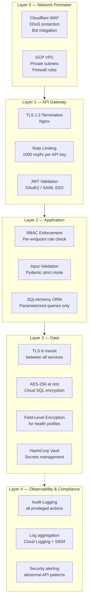

### 13.2 Authentication & Authorization Matrix

| Role | Scope | Auth Method | Data Access |
|---|---|---|---|
| **citizen** | Own location only | JWT (email/OTP) | Own AQI, own health profile |
| **ward_admin** | Assigned ward | JWT + SAML | Ward AQI, attribution, alerts |
| **district_admin** | All wards in district | SAML SSO (Gov IdP) | Full district dashboard + reports |
| **state_admin** | All districts in state | SAML SSO (Gov IdP) | Full state dashboard + reports |
| **researcher** | All wards (read-only) | API Key | Aggregated data only; no PII |
| **api_user** | Configured scope | API Key + rate limit | Scoped endpoints per contract |
| **ml_service** | Internal only | mTLS service account | Read DB; write predictions |
| **airflow** | Internal only | Service account IAM | Read/write all data tables |

### 13.3 Citizen Data Privacy Design

```
Health Profile Encryption:
  Field: app_user.health_profile (JSONB)
  Encryption: AES-256-GCM using Vault-managed DEK
  Key rotation: Every 90 days
  Access: Only user_service can decrypt; other services receive anonymized profile ID

Consent Framework:
  First launch: Explicit opt-in for location tracking
  Health profile: Opt-in with DPDP-compliant consent form
  Analytics: Opt-in for anonymous usage analytics
  Alerts: Opt-in per channel (push/WhatsApp/email)

Data Minimization:
  Location: GPS coordinates hashed to grid cell ID; raw coords never stored
  Health profile: Only condition flags stored (boolean); no free-text medical data
  Analytics: All citizen analytics are aggregated; no individual-level tracking

Data Deletion:
  Citizen account deletion: Cascade delete all personal data within 72 hours
  Health profile: Independently deletable without deleting account
  Logs: Automatically purged after 90 days per DPDP retention rules
```

### 13.4 API Security Controls

```
Authentication:
  Government users: SAML 2.0 SSO via government IdP (NIC / state SSO)
  Citizen users:    OTP-based (mobile number) + Google OAuth
  API consumers:    API Key (SHA-256 hashed in DB) + optional IP allowlist

Rate Limiting (Redis token bucket):
  Free tier:        100 req/hour per API key
  Government tier:  10,000 req/hour (no limit on dashboard)
  Research tier:    5,000 req/hour, historical data access

Input Validation:
  All IDs: UUID v4 format enforced
  Coordinates: Bounds checked to India bounding box
  Date ranges: Maximum 365-day range enforced
  String fields: Max length enforced; HTML escaped

Secrets Management:
  All secrets in HashiCorp Vault (dev: .env files)
  DB passwords, API keys, LLM keys — zero hardcoded secrets
  Kubernetes: Vault Agent Injector for pod-level secret injection
  Rotation: All secrets rotated every 90 days
```

---

## Appendix A — Technology Stack Summary

| Layer | Technology | Version | License |
|---|---|---|---|
| **API Framework** | FastAPI | 0.111+ | MIT |
| **ML Framework** | PyTorch + PyTorch Geometric | 2.3+ | BSD |
| **Forecast Model** | PyTorch Forecasting (TFT) | 1.0+ | MIT |
| **Explainability** | SHAP | 0.45+ | MIT |
| **ML Serving** | ONNX Runtime | 1.18+ | MIT |
| **ML Tracking** | MLflow | 2.13+ | Apache 2.0 |
| **LLM** | Google Gemini Pro | API | Commercial |
| **Orchestration** | Apache Airflow | 2.9+ | Apache 2.0 |
| **Message Bus** | Apache Kafka | 3.7+ | Apache 2.0 |
| **Task Queue** | Celery + Redis | 5.4+ | BSD |
| **Database** | PostgreSQL + PostGIS | 16 / 3.4 | PostgreSQL |
| **Time Series DB** | TimescaleDB | 2.15+ | Timescale |
| **Cache** | Redis | 7.2+ | BSD |
| **Object Storage** | MinIO | Latest | AGPL |
| **GIS Tiles** | pg_tileserv + MapLibre GL | Latest | Apache 2.0 |
| **Frontend** | Next.js 14 + React 18 | 14.x | MIT |
| **Citizen App** | Vite + React + PWA | 5.x | MIT |
| **State Management** | Zustand + React Query | 4.x / 5.x | MIT |
| **Charts** | Recharts + D3.js | 2.x / 7.x | MIT |
| **PDF Generation** | WeasyPrint + Jinja2 | 60+ | BSD |
| **Container Runtime** | Docker + Compose | 24+ | Apache 2.0 |
| **Orchestration** | Kubernetes (GKE) | 1.29+ | Apache 2.0 |
| **Secrets** | HashiCorp Vault | 1.16+ | BUSL / OSS |
| **Observability** | Prometheus + Grafana | Latest | Apache 2.0 |
| **WAF / CDN** | Cloudflare | — | Commercial |

---

## Appendix B — Key Design Decisions & Trade-offs

| Decision | Choice | Alternative Considered | Rationale |
|---|---|---|---|
| Microservices vs Monolith | Monorepo + loosely-coupled services | Full microservices | Hackathon speed; services share code but deploy independently |
| GNN vs CNN for AQI | Graph Attention Network | CNN spatial grid | Graphs model ward adjacency and wind relationships natively |
| TFT vs LSTM for forecast | Temporal Fusion Transformer | LSTM / N-BEATS | TFT natively handles known future covariates (holiday flags, hour) |
| XGBoost for attribution | XGBoost + SHAP | Deep learning classifier | SHAP TreeExplainer is exact (not approximate) for tree models |
| FastAPI vs Django | FastAPI | Django REST Framework | Async-native; auto-generates OpenAPI; Pydantic integration |
| TimescaleDB vs InfluxDB | TimescaleDB | InfluxDB | PostgreSQL-compatible; PostGIS extension available; SQL familiarity |
| Kafka vs RabbitMQ | Kafka | RabbitMQ | Replay capability; ordered partitions by ward; future event sourcing |
| MapLibre vs Leaflet | MapLibre GL JS | Leaflet.js | GPU-accelerated WebGL rendering; vector tile support; no vendor lock |
| Gemini Pro vs GPT-4o | Gemini Pro | GPT-4o / Claude | Google ecosystem; lower latency from GCP; structured output support |

---

*© 2026 AirSight AI. Internal Architecture Document.*
*Prepared for ET AI Hackathon 2026 — Principal Architect Review.*
